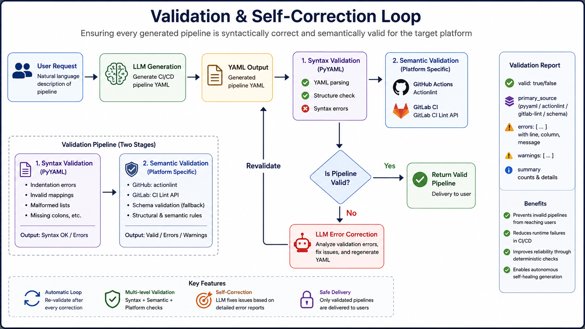

# 🪄 YAML-Wizard
    Bridging the gap between Plain English and Production-Ready CI/CD Pipelines.

## Overview
YAML Wizard is an AI-powered DevOps assistant that helps developers generate, validate, manage, and publish CI/CD pipeline configurations for both GitHub Actions and GitLab CI/CD.

Instead of manually writing complex YAML files, developers simply connect their repositories and describe the desired workflow in plain English. YAML Wizard analyzes the project's codebase, understands its technology stack, generates production-ready pipeline configurations, validates them against platform-specific rules, and can publish them directly back to the repository.

The platform eliminates repetitive manual configuration while ensuring generated pipelines remain project-aware, platform-compliant, and version controlled.

## Key Features

### Multi-Platform Support
- Generate CI/CD pipelines for:

    - GitHub Actions
    - GitLab CI/CD

### Repository-Aware Context Extraction

Instead of asking developers to manually describe their project, YAML Wizard automatically analyzes connected repositories.

It scans the repository structure using Git provider APIs and extracts information such as:

- Programming languages
- Frameworks
- Build tools
- Package managers
- Test frameworks
- Docker usage
- Existing CI/CD pipelines
- Project directory structure
- Key configuration files

The extracted context is stored in the database and reused across future generations.

### AI-Powered YAML Generation

Developers simply provide a natural language description of the desired workflow.

For example:

    "Build the project, run tests on Python 3.12, and deploy to Railway when changes are pushed to main."

The generation engine combines:

- User requirements
- Repository context
- Platform-specific conventions
- CI/CD best practices

to produce a complete pipeline configuration.

### Smart Validation

Every generated pipeline is automatically validated before publication.

Validation includes:

- YAML syntax validation
- Schema validation
- Platform-specific rule validation

This helps prevent invalid or broken pipeline configurations.
<p align="center">
    
</p>


### Execution-Level Dry Runs

After passing validation, pipelines can be verified through execution-level testing before publication.

- **GitHub:** Local simulation using **act** and Docker to mirror the GitHub Actions runner.
- **GitLab:** Execution through the GitLab CI API on temporary branches.

This provides confidence that the generated workflow behaves as expected before being committed.


### Structural Job-Level Editing

Instead of editing raw YAML text, YAML Wizard operates on pipeline jobs as structured components.

- **Round-Trip Preservation:** Uses **ruamel.yaml** to preserve comments, formatting, quotes, and key ordering.
- **Atomic Editing:** Add, remove, or reorder individual jobs without affecting the rest of the pipeline.


### Git Integration

Generated pipelines can be published directly to source control.

Supported actions include:

- Commit directly to the repository
- Open Pull Requests (GitHub)
- Open Merge Requests (GitLab)


### Versioned YAML Storage & AI Pipeline Assistant

Every generated pipeline, along with existing repository pipelines, is stored for future reference.

This enables:

- Version history
- Rollback
- Pipeline comparison
- Configuration tracking
- AI-powered pipeline assistant for explaining workflows, answering questions about the selected pipeline, troubleshooting issues, and suggesting improvements.

---
## How It Works

1. **Secure Onboarding**

    YAML Wizard offers three ways to connect your projects:

    - **GitHub App** (works for repositories owned by the user only): 
        
        Install our GitHub App for automated project syncing. When you add/remove repos, YAML Wizard updates automatically. Security First: We use ephemeral tokens for actions; no long-term tokens are stored in our database.
        

        <p align="center">
            
        </p>

    - **GitHub & GitLab OAuth**: Connect via GitLab API for seamless integration.
        <p align="center">
            
        </p>
    - **Manual Repository URL** (you need to connect your git account first): 
    
        Simply provide a public URL, and our context agent will gather the necessary data.


2. **Context Extraction**
    
    Once a project is connected, our Context Agent goes to work:

    - GitHub: Utilizes GraphQL for efficient data fetching.
    - GitLab: Utilizes REST APIs.

    Storage: Technical metadata is stored to provide the LLM with the exact "blueprint" of your application.


3. **The Generation Workflow**
<p align="center">
    
</p>

4. **Edit & Validate**
    
    Refine jobs in the structural editor and run a Dry Run to verify execution logic.

5. **Commit & Version**

    Publish directly via a Pull Request or Merge Request. Every version is saved for easy rollback.

---

## Technical Architecture
YAML Wizard is built with a modern, high-performance stack designed for real-time interaction and heavy-duty AI processing.

### Core Stack
| Layer | Technology |
|-------|------------|
| **Frontend** | React with TypeScript for a type-safe, responsive user interface. |
| **Backend** | FastAPI (Python) for high-performance, asynchronous API endpoints. |
| **Database** | PostgreSQL for robust storage of repository context, versioned YAML history, and user data. |
| **Real-time Communication** | WebSockets to provide live updates during repository context scanning and streaming LLM generation. |


### AI Engine & Model Deployment

YAML Wizard leverages a state-of-the-art open-source large language model deployed on dedicated GPU infrastructure to provide fast, reliable, and privacy-conscious inference.

- **Model:** Qwen/Qwen2.5-72B-Instruct-AWQ
- **Hosting:** Self-hosted on Vast.ai high-performance GPU instances
- **Inference Engine:** vLLM for high-throughput, low-latency serving
- **Optimization:** AWQ (Activation-aware Weight Quantization) reduces VRAM requirements while preserving the capabilities of the 72B-parameter model.


### Development Tunneling

- **ngrok:** Enables secure local-to-cloud tunneling, allowing GitHub and GitLab webhooks to reach the local FastAPI backend during development and testing.

---

##  Security & Privacy

Security is a core design principle of YAML Wizard. The platform follows a defense-in-depth approach to protect user credentials, repository data, and sensitive configuration throughout the entire CI/CD generation workflow.

### Authentication & Authorization

- **JWT Authentication:** Secure JSON Web Tokens (JWT) authenticate every API request and manage user sessions.
- **Resource Isolation:** Authorization checks ensure users can only access their own repositories, projects, chat history, and generated pipelines.


### Secure Git Integration

YAML Wizard supports both **GitHub App** and **OAuth** authentication while adhering to the **Principle of Least Privilege**.

#### GitHub App (Recommended)

- **Ephemeral Access Tokens:** Installation tokens are generated on demand and expire automatically.
- **Zero Token Persistence:** Tokens are never stored in the database and exist only in memory during repository operations.
- **Minimal Permissions:** Access is limited to the repository metadata and CI/CD-related resources required by the application.

#### GitHub & GitLab OAuth

- **Encrypted Token Storage:** OAuth access tokens are encrypted at rest using **Fernet** symmetric encryption.
- **Key Separation:** Encryption keys are stored independently from the database, preventing credential exposure even if the database is compromised.


### Secret Protection

To prevent sensitive information from reaching the LLM, YAML Wizard employs a multi-stage redaction pipeline.

- **Environment Variable Sanitization:** Configuration files (e.g., `.env`) are scanned to identify variable names while discarding their values.
- **LLM Secret Redaction:** API keys, access tokens, passwords, and other credentials are automatically replaced with placeholders before any content is processed by the LLM.
- **Structure Preservation:** The model receives only the repository structure and configuration patterns required to generate accurate CI/CD pipelines—never the actual secrets.


### Additional Security Measures

- **CSRF Protection:** OAuth flows verify the `state` parameter to prevent Cross-Site Request Forgery attacks.
- **Secure Webhooks:** During development, **ngrok** provides encrypted tunnels for secure webhook communication with GitHub and GitLab.

---

## Evaluation & Benchmarking

To evaluate YAML Wizard's ability to generate production-ready CI/CD pipelines, we evaluated it across five widely used open-source repositories spanning Python, JavaScript, and Java ecosystems.

### Methodology

The evaluation measured the assistant's ability to synthesize pipelines **without access to the original CI/CD configuration**.

1. **Context Isolation** – Existing CI/CD files (e.g., `.github/workflows` and `.gitlab-ci.yml`) were excluded from the model's context.
2. **Repository Analysis** – The Context Agent analyzed the source code, project structure, dependency files, and build configuration.
3. **Pipeline Generation** – The LLM generated a complete CI/CD pipeline based solely on the extracted repository context.
4. **Ground Truth Comparison** – The generated pipeline was compared against the repository's original human-authored pipeline.

### Evaluation Metrics

| Metric | Description |
|--------|-------------|
| **Quality Score** | Measures correctness, completeness, adherence to CI/CD best practices, and overall production readiness. |
| **Similarity Score** | Measures how closely the generated pipeline matches the original implementation, including workflow structure, triggers, jobs, and execution steps. |


### Results

| Repository | Language | Quality Score | Similarity Score |
|------------|----------|--------------:|-----------------:|
| Requests | Python | **81.4%** | **91.2%** |
| Flask | Python | **78.8%** | **89.6%** |
| Express | Node.js | **84.5%** | **95.1%** |
| Spring PetClinic | Java | **79.7%** | **90.4%** |
| Pytest | Python | **82.6%** | **94.3%** |
| **Average** | — | **81%** | **92%** |


### Key Findings

- **Repository-aware generation:** An average **92% Similarity Score** demonstrates that YAML Wizard produces pipelines closely aligned with maintainers' original workflows rather than relying on generic templates.
- **Production-oriented quality:** The generated pipelines achieved an average **81% Quality Score**, reflecting strong adherence to CI/CD best practices and project-specific requirements.
- **Reduced hallucinations:** Repository context significantly improved generation accuracy by minimizing invalid GitHub Actions, deprecated syntax, and unsupported workflow configurations.
- **Accurate workflow synthesis:** The assistant consistently inferred appropriate workflow triggers, dependency caching strategies, and language-specific build and test steps.


---

## 🚀 Getting Started

## 1. Clone the Repository

```bash
git clone https://github.com/alaaashraf19/YAML-Wizard.git
cd YAML-Wizard
```


## 2. Create Developer Applications

YAML Wizard integrates with GitHub and GitLab using both **GitHub Apps** and **OAuth**. Before running the project, create your own developer applications and configure them with your **ngrok** URL.

### GitHub App

Create a new GitHub App and configure:

- **Webhook URL:** `https://<your-ngrok-url>`
- **Permissions:**
  - Actions → Read & Write
  - Pull Requests → Read & Write
  - Workflows → Read & Write
  - Metadata → Read-only
- Generate and download the **Private Key** (`.pem`), place it inside Backend/ 

### GitHub OAuth App

Create an OAuth App with:

**Required OAuth Scopes**
  - `repo`
  - `workflow`
  - `read:user`
  - `user:email`
```
Authorization callback URL:
https://<your-ngrok-url>/auth/github/callback
```

### GitLab OAuth Application

Create a GitLab OAuth Application with:

**Required OAuth Scopes**
  - `api`
```
Redirect URI:
https://<your-ngrok-url>/auth/gitlab/callback
```


## 3. Configuration (Environment Variables)

Create the following files using the provided `.env.example` templates:

- `.env`
- `frontend/.env`

The backend configuration is organized into the following categories.

### Database & Core API

| Variable | Description |
|----------|-------------|
| `DATABASE_URL` | PostgreSQL connection string. |
| `SECRET_KEY` | Secret used for JWT signing. |
| `ACCESS_TOKEN_EXPIRE_MINUTES` | JWT expiration time (e.g., `60`). |
| `FRONTEND_BASE_URL` | URL of the React frontend (e.g., `http://localhost:5173`). |

### AI & LLM Configuration

| Variable | Description |
|----------|-------------|
| `GROQ_API_KEY` | API key for Groq inference. |
| `GROQ_MODEL` | Primary model used for pipeline generation. |
| `GROQ_REVIEW_MODEL` | Model used for AI pipeline assistance. |
| `GEMINI_API_KEY` | Optional fallback Gemini API key. |

### GitHub App Configuration

| Variable | Description |
|----------|-------------|
| `APP_ID` | GitHub App ID. |

### OAuth Configuration

| Variable | Description |
|----------|-------------|
| `GITHUB_CLIENT_ID` | GitHub OAuth Client ID. |
| `GITHUB_CLIENT_SECRET` | GitHub OAuth Client Secret. |
| `GITHUB_REDIRECT_URL` | GitHub OAuth callback URL. |
| `GITLAB_CLIENT_ID` | GitLab OAuth Client ID. |
| `GITLAB_CLIENT_SECRET` | GitLab OAuth Client Secret. |
| `GITLAB_REDIRECT_URI` | GitLab OAuth callback URL. |

### Security & Synchronization

| Variable | Description |
|----------|-------------|
| `FERNET_KEY` | Encrypts stored OAuth tokens. |
| `SYNC_INTERVAL_MINUTES` | Repository synchronization interval. |
| `MAX_RUNS_PER_SYNC` | Maximum repositories synchronized per cycle. |

### Optional Services

| Variable | Description |
|----------|-------------|
| `CLOUDINARY_CLOUD_NAME` | Cloudinary cloud name. |
| `CLOUDINARY_API_KEY` | Cloudinary API key. |
| `CLOUDINARY_API_SECRET` | Cloudinary API secret. |

The frontend configuration (`frontend/.env`) primarily contains the backend API and WebSocket URLs.

```env
VITE_API_URL=https://your-ngrok-url.ngrok-free.dev
VITE_WS_URL=wss://your-ngrok-url.ngrok-free.dev
```


## 4. Install Frontend Dependencies

```bash
cd frontend
npm install
```


## 5. Install Backend Dependencies

Return to the project root and install the required Python packages.

```bash
cd ..
pip install -r requirements.txt
```


## 6. Configure CORS

Update the allowed origins to include your current **ngrok** URL.

```python
Backend/middleware/middleware.py

allow_origins=[
    "http://localhost:5173",
    "https://your-unique-id.ngrok-free.dev",
]
```

> Replace the ngrok URL with your own.


## 7. Run the Application

### Start ngrok

```bash
ngrok http 8000
```

### Start the Backend

```bash
uvicorn main:app --host 0.0.0.0 --port 8000
```

> **Important:** Do **not** use `--reload`. The Dry Run engine temporarily modifies local files, which can trigger continuous restart loops when auto-reload is enabled.

### Start the Frontend

```bash
cd frontend
npm run dev
```


## 8. Open the Application

Open the frontend URL shown by Vite (typically `http://localhost:5173`) and begin connecting your GitHub or GitLab accounts and repositories.

